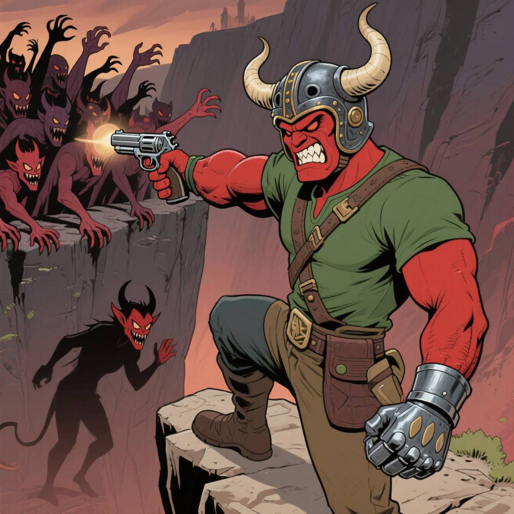

# PVP.FUN - Revolutionary Pixel-Style CS Shooter on Solana

<p align="center">
  
</p>

<p align="center">
  <a href="https://pvpfun.fun">Website</a> •
  <a href="https://x.com/PVPFUNSOL">Twitter</a> •
  <a href="https://github.com/PVPFUNweb3/PvpFunWeb3.git">GitHub</a>
</p>

## 🎮 Overview

PVP.FUN is a pioneering pixel-style Counter-Strike shooter game built on the Solana blockchain. Launched via the pump.fun platform, PVP.FUN delivers a fast-paced Multiplayer Online Battle Arena (MOBA) experience that integrates NFTs, decentralized asset ownership, and on-chain governance to create an immersive, fair, and community-driven ecosystem for global Web3 users.

Our mission is to bring the adrenaline of traditional First-Person Shooter (FPS) games into Web3, empowering players with asset ownership and governance through blockchain technology.

## 🚀 Core Features

- **Real-Time Multiplayer Battles**: Experience 5v5 combat with <50ms latency and 60 FPS performance
- **NFT Weapon Skins**: Mint, collect, and trade unique pixel-art weapon skins with on-chain provenance
- **PVP Token Economy**: Earn tokens based on skill, compete in tournaments, and participate in governance
- **DAO Governance**: Vote on game modes, maps, and tournament structures as a community
- **Cross-Platform Compatibility**: Play on PC, mobile, and browser with seamless integration

## 🏗️ Technical Architecture

PVP.FUN is built on a sophisticated technical stack that leverages Solana's high throughput (65,000 TPS) and low transaction costs (~$0.00025):

### On-Chain Game Engine
- **Pixel Rendering Module**: WebGL with 2D pixel art (60 FPS rendering)
- **Physics Simulation**: Lightweight Bullet Physics SDK for trajectories and collisions
- **On-Chain State Synchronization**: Records game data via Solana's Program Library (SPL)

### Real-Time Multiplayer Protocol
- **WebSocket Communication**: <50ms latency for fluid combat
- **Client-Side Prediction & Rollback Netcode**: Ensures smooth gameplay during network fluctuations
- **Distributed Server Architecture**: AWS GameLift and Solana off-chain compute nodes

### NFT Asset System
- **Generative NFT Engine**: Creates unique weapon skins and characters using GANs
- **On-Chain Metadata**: Compatible with OpenSea and Magic Eden standards
- **Dynamic Attributes**: NFTs evolve through in-game achievements

### AI-Powered Game Balance
- **Dynamic Matchmaking**: Deep Q-Networks for fair player matching
- **Game Balance Optimization**: Proximal Policy Optimization for weapon and map balance
- **Anti-Cheat System**: AI-driven behavior analysis with <1% false positives

## 🛠️ Tech Stack

- **Frontend**: Next.js, React, TypeScript, Tailwind CSS, WebGL
- **Blockchain**: Solana, SPL Tokens, NFT Standards
- **Web3 Integration**: Solana Wallet Adapter, Web3.js
- **Infrastructure**: AWS GameLift, IPFS/Arweave for decentralized storage
- **AI/ML**: TensorFlow for matchmaking and anti-cheat systems

## 🏁 Getting Started

### Prerequisites
- Node.js 18+
- NPM or Yarn
- Solana wallet (Phantom, Solflare, etc.)

### Installation

1. Clone the repository:
```bash
git clone https://github.com/PVPFUNweb3/PvpFunWeb3.git
cd pvp-fun-web3
```

2. Install dependencies:
```bash
npm install
```

3. Set up environment variables (copy from example):
```bash
cp env.example .env.local
```

4. Run the development server:
```bash
npm run dev
```

5. Open [http://localhost:3000](http://localhost:3000) in your browser

### Docker Deployment

```bash
docker-compose up -d
```

## 🎯 Game Controls

- **Arrow Keys**: Move character in four directions
- **Spacebar**: Shoot weapons
- **Tab**: View scoreboard and match stats
- **E**: Interact with objects/plant bombs
- **R**: Reload weapons

## 📊 Project Structure

```
pvp-fun-web3/
├── app/                    # Next.js app directory
│   ├── components/         # Reusable UI components
│   │   ├── GameCanvas.tsx  # WebGL game rendering
│   │   ├── NftCard.tsx     # NFT display component
│   │   └── TokenInfo.tsx   # PVP token information
│   ├── api/                # Backend API routes
│   │   └── solana/         # Blockchain interaction endpoints
│   ├── game/               # Game-specific pages and logic
│   ├── nfts/               # NFT marketplace and collection
│   ├── token/              # Token utility and staking
│   └── utils/              # Utility functions
│       └── solana.ts       # Solana wallet integration
├── public/                 # Static assets
├── .github/                # CI/CD workflows
└── docker-compose.yml      # Docker configuration
```

## 🗺️ Roadmap

### Short-Term (2025 Q2-Q3)
- Launch PVP token on pump.fun (30,000 community members target)
- Release PVP.FUN beta dApp with 5v5 multiplayer and NFT skin minting
- Host "PVP.FUN Global Shootout" tournament with exclusive NFT rewards

### Mid-Term (2025 Q4-2026 Q2)
- Expand to 10 game modes and 20 maps
- Scale to support 100,000 concurrent players
- Partner with global esports platforms for official tournaments
- Integrate with Solana metaverse projects for cross-platform skin usage

### Long-Term (2026+)
- Capture 20% of the Web3 gaming market (1M monthly active players)
- Develop AI-driven spectator tools for real-time esports analytics
- Release PVP.FUN SDK for custom maps and modes development
- Establish PVP.FUN as Solana's leading GameFi platform

## 📜 License

This project is licensed under the MIT License - see the LICENSE file for details.

## 🔗 Links

- **Website**: [https://pvpfun.fun](https://pvpfun.fun)
- **Twitter**: [@PVPFUNSOL](https://x.com/PVPFUNSOL)
- **Documentation**: [Coming Soon]()

---

<p align="center">PVP.FUN: Battle, Mint, Govern</p> 
